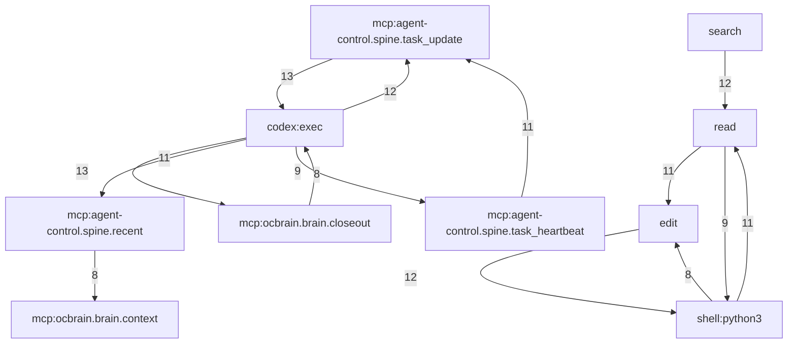

# Procedure Atlas

Generated 2026-08-24T19:34:33.309316+00:00 by `scripts/procmine`. Every number below is computed from the live corpus at generation time; rerun the miner to refresh it.

## 1. Corpus

**190,909 normalized tool calls** across **1,820 sessions**, and **1,105 closeouts** from 2026-07-15T18:39:22.765692+00:00 to 2026-08-24T19:13:00.229678+00:00.

| runtime | sessions | tool calls | failed calls | failure rate |
|---|---|---|---|---|
| hermes | 411 | 109,696 | 5541 | 0.051 |
| codex | 443 | 34,368 | 2276 | 0.066 |
| hermes-legacy | 793 | 27,797 | 845 | 0.03 |
| claude-code | 67 | 9,583 | 329 | 0.034 |
| claude-code-subagent | 106 | 9,465 | 124 | 0.013 |

Result classes across all calls:

| result_class | calls | share |
|---|---|---|
| ok | 179,739 | 94.1% |
| error | 7,874 | 4.1% |
| empty | 2,055 | 1.1% |
| refused | 817 | 0.4% |
| timeout | 424 | 0.2% |

## 2. Join yield: how much of the label set actually reaches a trace

**488 of 1105 closeouts (44%) resolve to a trace.** Only 38 do so by identity; the rest are temporal matches within the runtime family.

| join tier | closeouts | what it means |
|---|---|---|
| exact | 36 | `session_id` equals a trace id |
| uuid | 2 | a UUID inside `session_id` equals a trace id |
| temporal | 135 | same runtime family, `closed_at` inside exactly one session window +/-45min |
| temporal-context | 31 | several sessions were open; exactly one worked in a directory the closeout names |
| temporal-ambiguous | 284 | several sessions were open and nothing distinguishes them; attached but excluded from mining |
| unjoined | 617 | no trace found |

Joining is not the same as being usable. Two independence filters run before any procedure is mined:

| filter | episodes |
|---|---|
| joined to a trace | 488 |
| - dropped: ambiguous temporal match | 284 |
| = eligible | 204 |
| of those, sharing a session with another closeout (time-segmented) | 196 |
| - dropped: segment contained no tool calls | 95 |
| - dropped: fewer than 3 tool calls (cannot describe a procedure) | 1 |
| **= mining set** | **108** |

Segmentation matters more than it sounds. Long-running sessions file many closeouts, so without slicing, one codex heartbeat rollout would present itself as dozens of independent confirmations of the same procedure and every support count downstream would be inflated by its length. Slicing on `closed_at` gives each closeout the disjoint span of tool calls it is plausibly a receipt for.

Per normalized runtime:

| runtime | closeouts | joined | join rate | by identity | temporal | temporal+context | ambiguous |
|---|---|---|---|---|---|---|---|
| codex | 421 | 322 | 0.765 | 21 | 125 | 26 | 150 |
| unattributed-local | 365 | 9 | 0.025 | 9 | 0 | 0 | 0 |
| hermes | 145 | 145 | 1.0 | 2 | 10 | 3 | 130 |
| mcp-direct | 63 | 4 | 0.063 | 4 | 0 | 0 | 0 |
| cursor | 57 | 0 | 0.0 | 0 | 0 | 0 | 0 |
| host-batch | 25 | 0 | 0.0 | 0 | 0 | 0 | 0 |
| unknown | 21 | 0 | 0.0 | 0 | 0 | 0 | 0 |
| claude-code | 8 | 8 | 1.0 | 2 | 0 | 2 | 4 |

## 3. Label grades

`status` does not discriminate: 934 of the closeouts say completed. The grade ladder turns instead on whether the receipt can still be checked today.

| grade | all closeouts | closeouts with a trace |
|---|---|---|
| verifier-receipted | 249 | 122 |
| verifier-claimed | 236 | 59 |
| artifact-linked | 55 | 22 |
| self-reported-completed | 394 | 182 |
| partial | 133 | 68 |
| blocked-or-failed | 38 | 35 |

## 4. Procedures

74 task families were formed from the traced episodes. **1 cleared the support floor; 73 abstained.** Thresholds: {'min_family_episodes': 5, 'min_pattern_support': 4, 'min_pattern_coverage': 0.5, 'min_pattern_length': 3, 'min_node_support': 3, 'family_similarity': 0.34}.

### maximal / max / safe / url

12 traced episodes, 0 at artifact-linked or better (0%); median 50 steps.

- By grade: `{'self-reported-completed': 8, 'partial': 4}`
- By trace runtime: `{'codex': 12}`
- Receipts: `close_40365bcc45b47ea8, close_4b0e1451fcc9a828, close_762afcc2439ab82a, close_76d414a28e98979c, close_8367d5da68e1765e, close_a4a843c4ec38d8c0, close_c56e6746de8ba827, close_cf72390e599d924d, close_d7a79fd422854f4c, close_d884b9e71bfdc952, close_da77ee9042a7d3e8, close_e4aa05da23bb7f64`

Most-supported subsequence (11/12 episodes):

1. `mcp:agent-control.spine.recent`
2. `edit`
3. `mcp:ocbrain.brain.closeout`

### Abstentions

Families the miner refused to turn into a procedure:

| family | traced episodes | reason |
|---|---|---|
| feature / watchdog / personalization / lake | 6 | no 3+-step ordered subsequence reaches 4 of 6 traced episodes |
| logging / context / aleksey / pavlo | 3 | only 3 traced episodes; threshold is 5 |
| sdk / snapshot / private / skill | 3 | only 3 traced episodes; threshold is 5 |
| ten / report / chart / lifecycle | 3 | only 3 traced episodes; threshold is 5 |
| cro / oracle / dataset / refresh | 3 | only 3 traced episodes; threshold is 5 |
| deck / founder / headroom / header | 2 | only 2 traced episodes; threshold is 5 |
| f5zuwx2zt7ceqx3pnx5mt2qwupb2imavwkxb2btnqta / google / slides / slide | 2 | only 2 traced episodes; threshold is 5 |
| t20 / cf90d / health / download | 2 | only 2 traced episodes; threshold is 5 |
| handoff / founder / report / activate | 2 | only 2 traced episodes; threshold is 5 |
| gen013 / turn / supervisor / verify | 2 | only 2 traced episodes; threshold is 5 |
| super / autoresearch / max003 / max004 | 2 | only 2 traced episodes; threshold is 5 |
| explorer / cro / oracle / quick | 2 | only 2 traced episodes; threshold is 5 |
| device / channel / utm / recall | 2 | only 2 traced episodes; threshold is 5 |
| cofasc / brain / backed / coframe | 2 | only 2 traced episodes; threshold is 5 |
| ocbrain / promote / hosted / restoration | 2 | only 2 traced episodes; threshold is 5 |

...and 58 more.

## 5. Mined gotchas: recurring failure/repair pairs

Label-free and corpus-wide. A pair qualifies at >= 8 occurrences across >= 4 distinct sessions and >= 2.0x the base rate of that follow-up step. 49 pairs qualified; 3583 were rejected.

| when this fails | the next step is | times | sessions | next step worked | lift |
|---|---|---|---|---|---|
| `edit:<multi>` | `edit:<path:hermeswork:py>` | 136 | 11 | 100% | 8.9 |
| `mcp:agent-control.spine.recent` | `mcp:ocbrain.brain.context` | 118 | 44 | 100% | 81.5 |
| `edit:<multi>` | `read:<path:hermeswork:py>` | 104 | 33 | 96% | 4.5 |
| `codex:exec:mcp__ocbrain__brain_closeout` | `mcp:ocbrain.brain.closeout` | 71 | 29 | 0% | 212.2 |
| `mcp:ocbrain.brain.closeout` | `codex:exec:mcp__ocbrain__brain_closeout` | 69 | 31 | 86% | 279.2 |
| `tool:wait_agent` | `tool:list_agents` | 53 | 20 | 94% | 253.1 |
| `tool:wait_agent` | `tool:send_message` | 44 | 19 | 0% | 65.0 |
| `toolonly:terminal` | `toolonly:patch` | 43 | 35 | 95% | 6.7 |
| `toolonly:terminal` | `toolonly:search_files` | 43 | 42 | 100% | 3.6 |
| `toolonly:process` | `toolonly:terminal` | 41 | 22 | 93% | 8.8 |
| `tool:kanban_show` | `tool:skill_view` | 37 | 20 | 97% | 15.1 |
| `read:<path:hermeswork:py>` | `grep:<path:hermeswork>` | 31 | 22 | 100% | 6.1 |
| `codex:exec:mcp__agent_control__spine_task_update` | `mcp:agent-control.spine.task_update` | 29 | 7 | 100% | 156.4 |
| `edit:<path:hermeswork:py>` | `read:<path:hermeswork:py>` | 29 | 9 | 100% | 5.2 |
| `tool:process` | `edit:<multi>` | 28 | 7 | 79% | 2.4 |
| `mcp:agent-control.spine.recent` | `codex:exec:<script>` | 27 | 11 | 100% | 42.5 |
| `bash:ruff format <path:rel:py> <chain>` | `edit:<multi>` | 25 | 11 | 92% | 22.4 |
| `toolonly:terminal` | `toolonly:write_file` | 22 | 19 | 100% | 11.9 |
| `codex:exec:mcp__agent_control__spine_recent` | `mcp:agent-control.spine.recent` | 21 | 19 | 0% | 177.2 |
| `tool:process` | `bash:cd <path:tmp> <chain>` | 21 | 8 | 100% | 3.7 |

Plain retries are separated out — the agent reissued the same step. The interesting column is whether it worked, because a step that succeeds on immediate retry is flaky, not broken:

| step | retries after a failure | sessions | retry succeeded |
|---|---|---|---|
| `toolonly:terminal` | 399 | 214 | 86% |
| `edit:<multi>` | 158 | 39 | 85% |
| `tool:process` | 152 | 36 | 38% |
| `tool:execute_code` | 111 | 37 | 78% |
| `bash:cd <path:hermeswork> <chain>` | 106 | 35 | 92% |
| `mcp:ocbrain.brain.closeout` | 59 | 9 | 81% |
| `codex:exec:exec_command` | 59 | 20 | 85% |
| `edit:<path:hermeswork:py>` | 57 | 16 | 96% |
| `read:<path:hermeswork:md>` | 54 | 28 | 44% |
| `mcp:ocbrain.brain_closeout` | 51 | 23 | 53% |
| `read:<path:hermeswork:py>` | 46 | 27 | 83% |
| `tool:memory` | 45 | 14 | 58% |

## 6. Step reliability

Signatures with >= 50 calls, ranked by failure rate. This is the raw gotcha material.

| step | calls | sessions | failure rate | classes |
|---|---|---|---|---|
| `mcp:ocbrain.brain_closeout` | 112 | 27 | 61% | `{'error': 68, 'ok': 44}` |
| `tool:wait_agent` | 357 | 47 | 58% | `{'timeout': 207, 'ok': 150}` |
| `bash:sed -n <path:lake:json>` | 53 | 1 | 57% | `{'error': 30, 'ok': 23}` |
| `mcp:ocbrain.brain.source` | 73 | 10 | 52% | `{'error': 38, 'ok': 35}` |
| `bash:chmod <path:rel:py> <chain>` | 58 | 19 | 40% | `{'ok': 35, 'error': 23}` |
| `bash:git diff --unified <path:rel:py>` | 53 | 15 | 40% | `{'ok': 31, 'refused': 21, 'empty': 1}` |
| `bash:pytest -q <path:rel:py>` | 104 | 18 | 34% | `{'ok': 69, 'error': 30, 'refused': 5}` |
| `tool:kanban_complete` | 161 | 63 | 33% | `{'ok': 108, 'error': 53}` |
| `tool:memory` | 169 | 32 | 31% | `{'ok': 117, 'error': 52}` |
| `tool:process` | 2,177 | 97 | 30% | `{'ok': 1532, 'error': 644, 'empty': 1}` |
| `toolonly:process` | 304 | 74 | 29% | `{'ok': 217, 'error': 86, 'refused': 1}` |
| `tool:kanban_block` | 112 | 56 | 29% | `{'ok': 80, 'error': 32}` |
| `bash:python3 <path:rel> <chain>` | 170 | 51 | 28% | `{'ok': 122, 'error': 46, 'empty': 1, 'refused': 1}` |
| `codex:exec:mcp__agent_control__spine_task_update` | 116 | 11 | 27% | `{'ok': 85, 'error': 31}` |
| `read:<path:hermeswork>` | 57 | 15 | 25% | `{'ok': 43, 'error': 14}` |
| `bash:ruff check <path:rel:py> <chain>` | 366 | 61 | 24% | `{'ok': 277, 'error': 89}` |
| `mcp:agent-control.spine.recent` | 1,148 | 125 | 24% | `{'ok': 871, 'refused': 277}` |
| `bash:python3 <path:rel>` | 287 | 70 | 22% | `{'ok': 221, 'error': 64, 'empty': 2}` |
| `bash:ssh -eu -o <chain>` | 102 | 14 | 22% | `{'ok': 79, 'error': 22, 'empty': 1}` |
| `bash:git diff <path:rel:py>` | 53 | 22 | 21% | `{'ok': 40, 'refused': 11, 'empty': 2}` |
| `codex:exec:mcp__ocbrain__brain_closeout` | 354 | 61 | 20% | `{'ok': 282, 'error': 71, 'empty': 1}` |
| `bash:pwd <chain>` | 221 | 109 | 18% | `{'ok': 181, 'error': 34, 'refused': 6}` |
| `mcp:Claude_Browser.computer` | 67 | 9 | 18% | `{'ok': 55, 'error': 7, 'timeout': 5}` |
| `bash:ssh -o <path:home> <chain>` | 173 | 25 | 17% | `{'ok': 142, 'error': 25, 'timeout': 5, 'empty': 1}` |
| `bash:ssh -o <path:abs>` | 71 | 9 | 17% | `{'ok': 59, 'error': 12}` |

## 7. Cross-runtime comparison

### 7a. Whole corpus (label-free)

Every session, whether or not a closeout was ever filed against it. This is the comparison with real N behind it.

| runtime | sessions | tool calls | median steps | p90 | longest | call failure rate |
|---|---|---|---|---|---|---|
| hermes-legacy | 793 | 27,797 | 19 | 91 | 262 | 3.0% |
| codex | 443 | 34,368 | 37 | 141 | 3970 | 6.6% |
| hermes | 411 | 109,696 | 80 | 450 | 7561 | 5.1% |
| claude-code-subagent | 106 | 9,465 | 55 | 146 | 2607 | 1.3% |
| claude-code | 67 | 9,583 | 54 | 424 | 977 | 3.4% |

Step mix (share of that runtime's calls, abstract step classes):

- **hermes-legacy**: `shell` 40%, `read` 24%, `search` 15%, `edit` 8%, `skill` 5%, `write` 2%, `plan` 1%, `process` 1%
  - worst step class (>=100 calls): `process` fails 29% of 304 calls
- **codex**: `codex:exec` 16%, `read` 11%, `search` 6%, `web:search` 6%, `shell:nl` 4%, `shell:python` 4%, `wait` 4%, `mcp:agent-control.spine.recent` 3%
  - worst step class (>=100 calls): `git:diff` fails 53% of 257 calls
- **hermes**: `read` 17%, `shell-misc` 12%, `search` 12%, `edit` 11%, `remote` 7%, `skill` 5%, `shell` 5%, `write` 4%
  - worst step class (>=100 calls): `tool:kanban_complete` fails 33% of 161 calls
- **claude-code-subagent**: `shell-misc` 32%, `read` 27%, `shell:sleep` 14%, `edit` 6%, `search` 5%, `shell:<empty>` 3%, `list` 2%, `remote` 1%
  - worst step class (>=100 calls): `remote` fails 6% of 126 calls
- **claude-code**: `shell-misc` 28%, `edit` 18%, `read` 12%, `write` 5%, `search` 3%, `remote` 3%, `shell:<empty>` 3%, `gh:pr` 2%
  - worst step class (>=100 calls): `remote` fails 6% of 259 calls

### 7b. Labeled episodes only

Restricted to the mining set. Reported for completeness; the per-runtime counts outside codex are too small to support a comparison, and are labeled as such rather than dressed up.

| runtime | episodes | median steps | p90 steps | call failure rate | receipted+ |
|---|---|---|---|---|---|
| codex | 100 | 39 | 173 | 5% | 52% |
| claude-code-subagent | 4 | 59 | 62 | 1% | n too small |
| hermes-legacy | 2 | 84 | 84 | 2% | n too small |
| claude-code | 2 | 79 | 79 | 3% | n too small |

## 8. Corpus-wide motifs

Frequent contiguous step sequences across all 1,820 sessions, label-free, minimum 20 sessions. Structure without outcome.

| sequence | sessions |
|---|---|
| `search` -> `read` | 637 |
| `read` -> `search` | 617 |
| `read` -> `shell` | 585 |
| `shell` -> `read` | 554 |
| `read` -> `search` -> `read` | 435 |
| `search` -> `read` -> `search` | 412 |
| `shell` -> `search` | 383 |
| `search` -> `shell` | 366 |
| `shell` -> `read` -> `shell` | 357 |
| `search` -> `read` -> `search` -> `read` | 310 |
| `read` -> `shell` -> `read` | 305 |
| `read` -> `search` -> `read` -> `search` | 289 |
| `edit` -> `shell` | 257 |
| `shell` -> `edit` | 252 |
| `read` -> `edit` | 250 |
| `shell` -> `search` -> `read` | 229 |
| `read` -> `search` -> `read` -> `search` -> `read` | 223 |
| `skill` -> `read` | 222 |
| `shell` -> `search` -> `shell` | 215 |
| `read` -> `shell` -> `read` -> `shell` | 212 |

## 9. The mined gotchas, stated as claims

Generated from the counts above rather than written, so the wording cannot drift from the evidence. Threshold: >= 50 calls and >= 20% failure rate.

1. `tool:wait_agent` fails 207 of 357 calls (58%) across 47 sessions; the dominant failure class is `timeout` (207). Most common message (206x): "{"message":"Wait timed out.","timed_out":true}". The recurring next move is `tool:list_agents` (53 times, succeeding 94%).
   - seen on: `{'codex': 357}`; sessions to read: `019fc874-2645-7201-acd0-d4d47fe9b9a7, 019fc875-197a-79c0-a350-9aa333986385, 019fc95f-17a6-7af0-8b0b-673ff97d2dc2`
2. `mcp:ocbrain.brain_closeout` fails 68 of 112 calls (61%) across 27 sessions; the dominant failure class is `error` (68). Most common message (29x): "MCP error -<id>: Input validation error: Invalid arguments for tool brain.closeout: [". No distinct repair recurs; the agent retries the same step 51 times and it works 53% of the time.
   - seen on: `{'claude-code': 88, 'claude-code-subagent': 24}`; sessions to read: `04b1ec23-a199-4b78-bdb3-0ecb9e8bb4b0, 0be7cd0d-616d-4ba2-850a-e6c338afa89f, 0cc77f93-50d6-4c35-b0cd-52d80ec22a17`
3. `tool:process` fails 644 of 2177 calls (30%) across 97 sessions; the dominant failure class is `error` (644). Most common message (33x): "{"status": "timeout", "command": "uv run --with paramiko python -c 'import paramiko,time,sys; host=\"10.23.15.216\"; user=\"jonathan_coframe_com\"; keys=[\"/Use". The recurring next move is `edit:<multi>` (28 times, succeeding 79%).
   - seen on: `{'hermes': 2177}`; sessions to read: `20260807_141305_f6b22280, 20260807_141739_0f290e, 20260810_124335_ff3d8328`
4. `bash:sed -n <path:lake:json>` fails 30 of 53 calls (57%) across 1 sessions; the dominant failure class is `error` (30). Most common message (20x): ""fail": 0,".
   - seen on: `{'codex': 53}`; sessions to read: `019f8595-e6af-7683-b205-5648ed3e1316`
5. `mcp:ocbrain.brain.source` fails 38 of 73 calls (52%) across 10 sessions; the dominant failure class is `error` (38). Most common message (38x): "tool call error: tool call failed for `ocbrain/brain.source`". No distinct repair recurs; the agent retries the same step 28 times and it works 14% of the time.
   - seen on: `{'codex': 73}`; sessions to read: `019f9506-c3e1-7d43-8419-9d38d09bbcbe, 019fa4d4-a885-73e3-a9a6-59dc1789b596, 019fc133-ef20-7d60-9b34-8bfd336cc83c`
6. `mcp:agent-control.spine.recent` fails 277 of 1148 calls (24%) across 125 sessions; the dominant failure class is `refused` (277). Most common message (150x): "user rejected MCP tool call". The recurring next move is `mcp:ocbrain.brain.context` (118 times, succeeding 100%).
   - seen on: `{'codex': 1148}`; sessions to read: `019f9ecd-200d-7b82-951b-d96e613a8693, 019f9f4a-a0e6-7f73-9494-b8355bf6aab1, 019fa030-649a-71f1-bf6d-e22861fe605b`
7. `tool:kanban_complete` fails 53 of 161 calls (33%) across 63 sessions; the dominant failure class is `error` (53). Most common message (5x): "{"error": "could not complete t_dd9f149d (unknown id or already terminal)"}". The recurring next move is `tool:kanban_show` (15 times, succeeding 100%).
   - seen on: `{'hermes': 161}`; sessions to read: `20260810_124335_ff3d8328, 20260810_154431_d8ce9266, 20260810_234649_980a03`
8. `toolonly:process` fails 87 of 304 calls (29%) across 74 sessions; the dominant failure class is `error` (86). The recurring next move is `toolonly:terminal` (41 times, succeeding 93%).
   - seen on: `{'hermes-legacy': 304}`; sessions to read: `20260719_101552_e5038d20, 20260722_203559_bc2347, 20260723_013409_0ad4d2`
9. `bash:chmod <path:rel:py> <chain>` fails 23 of 58 calls (40%) across 19 sessions; the dominant failure class is `error` (23). Most common message (2x): "{"output": "2 files reformatted\nI001 [*] Import block is un-sorted or un-formatted\n --> scripts/vm/publish_dashboard_v2_projection.py:9:1\n |\n 7 | \"\"\"\n 8".
   - seen on: `{'hermes': 58}`; sessions to read: `20260812_093015_085674, 20260812_114454_1cb79162, 20260810_152957_963064`
10. `tool:memory` fails 52 of 169 calls (31%) across 32 sessions; the dominant failure class is `error` (52). Most common message (9x): "{"success": false, "error": "After applying all 1 operations, memory would be at 2,224/2,200 chars -- over the limit. Remove or shorten more entries in the same". No distinct repair recurs; the agent retries the same step 45 times and it works 58% of the time.
   - seen on: `{'hermes': 169}`; sessions to read: `20260807_141305_f6b22280, 20260810_124335_ff3d8328, 20260810_154431_d8ce9266`
11. `bash:git diff --unified <path:rel:py>` fails 21 of 53 calls (40%) across 15 sessions; the dominant failure class is `refused` (21). Most common message (21x): "git: warning: confstr() failed with code 5: couldn't get path of DARWIN_USER_TEMP_DIR; using /tmp instead".
   - seen on: `{'codex': 28, 'hermes': 25}`; sessions to read: `019fb993-3f8c-7192-802c-b3a7b1d8dab5, 019fd18a-987d-7112-9174-4c5ed1d05807, 019fd1bc-ee03-7571-844d-0f59fd808787`
12. `bash:pytest -q <path:rel:py>` fails 35 of 104 calls (34%) across 18 sessions; the dominant failure class is `error` (30). Most common message (5x): "{"output": "ERROR: file or directory not found: tests/data/acquisition/test_materialized_loader.py\n\n\nno tests ran in 0.00s", "exit_code": 4, "error": null}". The recurring next move is `grep:<path:hermeswork>` (9 times, succeeding 89%).
   - seen on: `{'hermes': 82, 'codex': 22}`; sessions to read: `019fc998-d559-7a80-ba6e-0b871e5b44e5, 019fcac0-e600-78a3-97ce-d4514a926734, 019fcac6-d96c-7e72-b1fd-0265ad5d7d39`

## 10. What this corpus cannot tell us

- **Cursor is invisible.** `scripts/export-cursor-chats.py` exports 226 messages across 5 workspaces with 0 tool fields between them, so all 57 cursor closeouts have no trace and cursor cannot appear in any comparison.
- **617 closeouts have no trace at all.** They are not missing at random: they concentrate in runtimes whose `session_id` was a human slug, so what is absent is exactly the work done outside the identity-carrying clients.
- **284 joins are ambiguous** because several sessions were open at once. Parallel sessions are normal here, so this is a permanent property of the setup, not a backlog to clear.
- **Timing is not attribution.** Even an unambiguous temporal join assumes the closeout describes the session that was open. Segmentation makes that assumption sharper, not true.
- **Grades measure receipts, not correctness.** `verifier-receipted` means a passed verifier whose file still exists. It does not mean the work was right, and a deleted artifact demotes a good episode.
- **Failure rates are per call, not per intent.** A step that fails and is immediately retried successfully counts once as a failure. That is the right measure for reliability and the wrong one for whether the agent got stuck.
- **hermes-legacy signatures are tool-only.** The legacy export never stored arguments, so its steps carry a `toolonly:` prefix and cannot be compared with the argument-shaped signatures from the other adapters at the fine level. Abstract step classes are comparable; raw signatures are not.
- **No counterfactual.** The corpus records what was done, never what would have happened otherwise, so nothing here supports a claim that one procedure *causes* a better outcome than another.

## 11. Adapter status

| runtime | status |
|---|---|
| claude-code | full: tool_use blocks carry name+input, tool_result carries is_error |
| codex | full: custom_tool_call/function_call/mcp_tool_call_end with outputs |
| hermes | full: per-profile state.db assistant.tool_calls + tool-role results |
| hermes-legacy | partial: export JSONL records the tool name but not its arguments |
| cursor | stub: the export carries no tool calls at all, only role/content |
